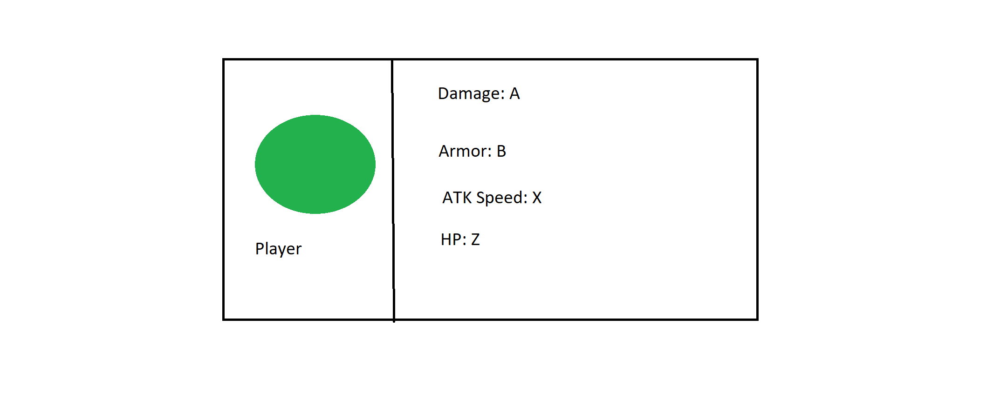
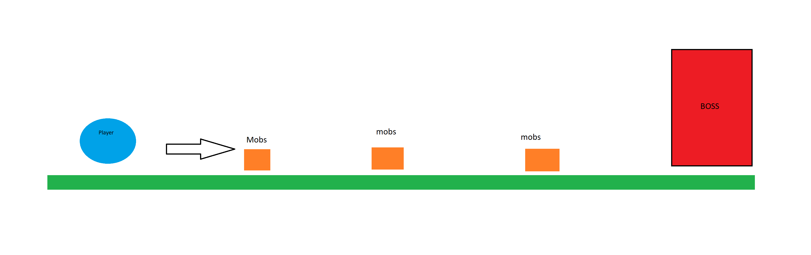
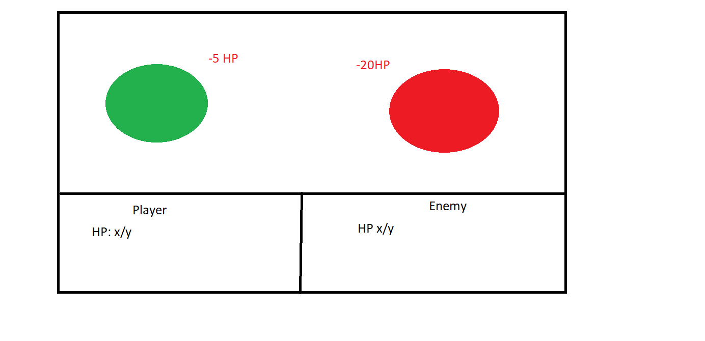
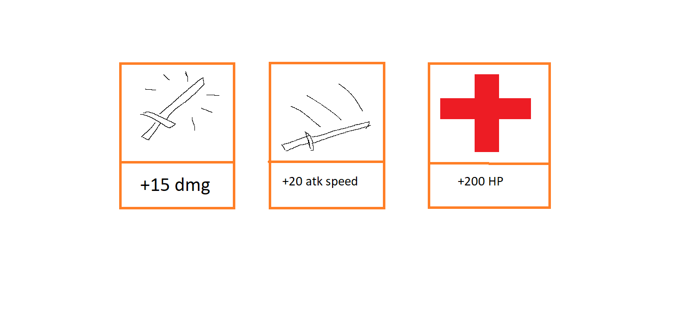

# PROJECT DESIGN DOCUMENT

# Tên game: Idle Knight

## Project Concept

___

### 1. Player Control

Bạn sẽ điều khiển ``` Knight ``` trong game `sideview 2d` này \
nơi mà ` lựa chọn của người chơi ` sẽ khiến cho nhân vật ` trở nên mạnh hơn ` 


### 2. Basic gameplay
Trong game, ` ở mỗi màn, người chơi sẽ tiêu diệt những mobs, monster xuất hiện lần lượt ` \
Mục tiêu của game: ` người chơi tiêu diệt quái để tích lũy sức mạnh của knight và tiêu diệt Boss ở cuối màn `


### 3. Sound & Effect
Sẽ có ` BGM effect ` và effect đặc biệt khi ` người chơi chạm chán quái vật `
Ngoài ra còn có `BGM và effect riêng khi chạm chán boss ở cuối màn `  


### 4. Gameplay Mechanic
Ở mỗi màn, sẽ xuất hiện ` từ 3-5 quái cấp thấp ` \
Người chơi sẽ và quái sẽ ` tự động tấn công nhau dựa theo chỉ số damage, giáp và HP ` \
Sau khi tiêu diệt thành công quái vật, người chơi sẽ được lựa chọn nâng cấp chỉ số nhân vật bao gồm:
  1. Damage
  2. Tốc độ đánh (ATK Speed)
  3. Giáp (Armor)
  3. HP


Lượng ATK Speed trong game sẽ được tính theo công thức:
```
Base Attack Time ÷ (1 + (Increased Attack Speed ÷ 100)) = Attack Speed
```

Lượng Giáp sẽ ảnh hưởng đến Damage Reduction (DR). Được tính theo công thức:
```
DR = (0.06*Armor)/(1+0.06*Armor)
```

Lượng HP sẽ mất được tính theo công thức:
```
Damage received = int(DMG * ATK speed * DR)
```


Ở cuối mỗi màn chơi, người chơi sẽ chạm chán với boss. Sau khi kết liễu boss, người chơi sẽ nhận được phần thưởng tăng sức mạnh của nhân vật đáng kể.
(Gameplay đánh boss hiện đang ở dạng auto atk, có thể chuyển sang turnbase nếu đủ mechanic).

Qua mỗi màn, người chơi sẽ được giữ lại chỉ số sức mạnh. Tuy nhiên quái cũng sẽ được nâng cấp để mạnh hơn.

Số lượng Màn chơi sẽ kéo dài mãi mãi  (Endless). Tuy nhiên do số lượng resource mà có thể quái và boss sẽ bị lặp lại asset.


### 5. User Interface
Hiển thị 4 chỉ số của nhân vật.

Khi người chơi chạm chán quái vật hoặc boss, màn hình tự động chiến đấu hiện lên.
Hiển thị các thông tin như: Số máu hiện có, lượng sát thương mỗi nhân vật gây ra

___

## PROJECT TIMELINE

## PROJECT SKETCH
Player's attribues


Main Scene


Battle Scene


Reward to Upgrade


-----------------------
## Update Timeline
* March 7, 2023: cập nhật `Battle Scene` với những tính năng cơ bản: Thanh HP, lượng Damage nhận vào.
* April 4, 2023: Cật nhật `Battle Scence` tự động mở khi gặp `enemyEncounter`. Tự động lấy chỉ số của `player` và `enemy` vào battle. Hiển thị bảng `Upgrade` cho `player`. Tự động trở về `Main Scene` sau khi win combat.
* April 6, 2023: Prototype gameplay mechanic, có cơ chế spawn quái mới sau khi combat. Xây dựng Init game basic và looping mechanic cho gameplay.
* April 7, 2023: Thêm background scrolling động cho game.
* April 9, 2023: Cập nhật sprite và animation cho `player` và `enemy`


## TODO
* Cập nhật UI và HUD cho :`Start game`, `Win combat` và `Lose combat`.
* Xây dựng End game và Restart game.
* music audio, ...
* Hiện Stats của `player`

## Bonus Feature
* Thêm sprite cho quái
* Xây dựng hệ thống data quái có những thuộc tính `stats` khác nhau
* Xây dựng Boss
* Xây dựng màn chơi looping hoặc level.

